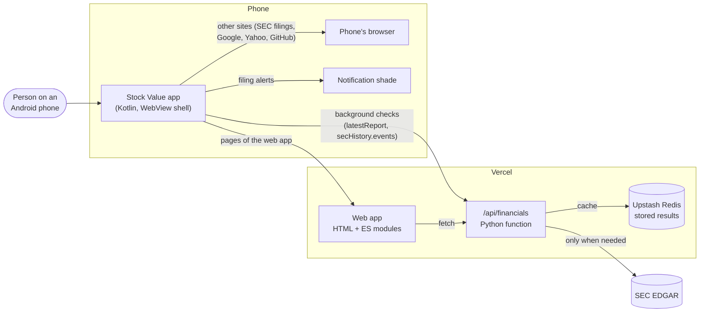
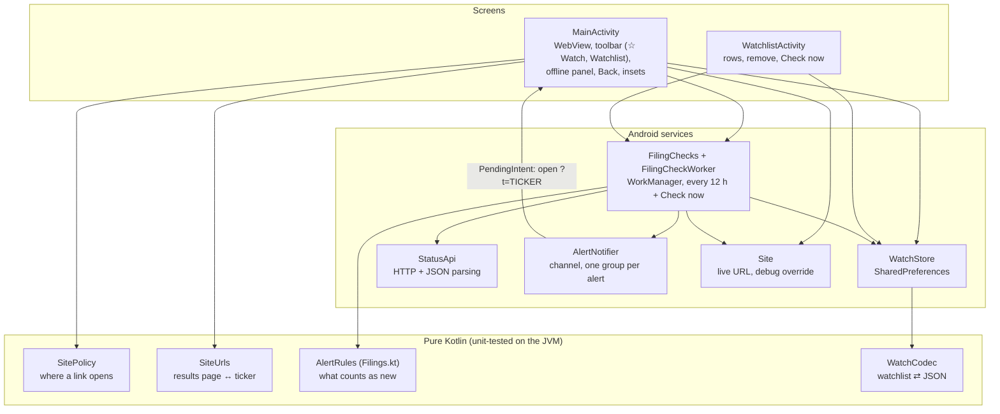
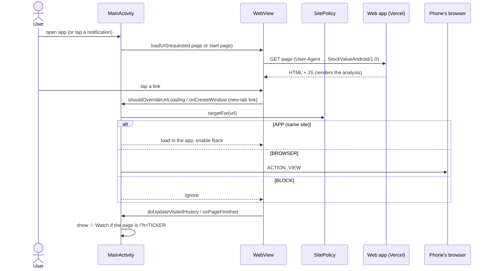
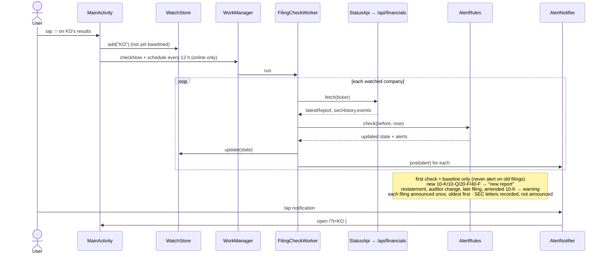
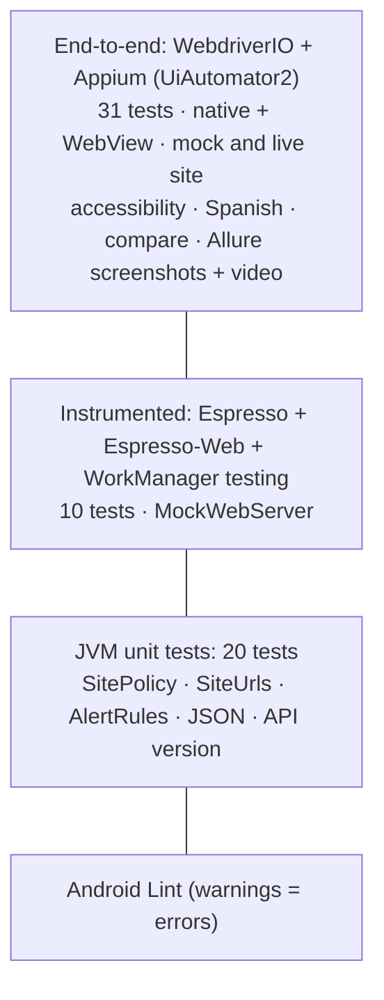
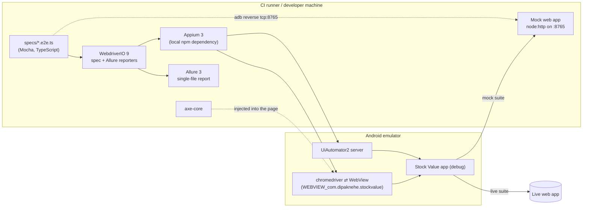
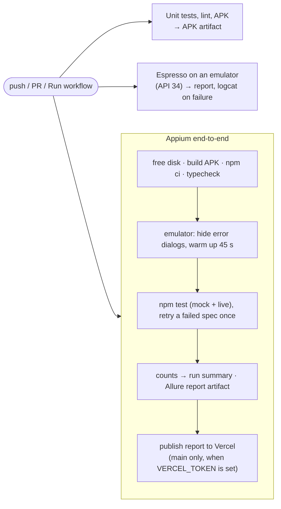

# Architecture: 10-Year Stock Value Analysis for Android

How the Android app is built, how its parts talk to each other and to the web app, and how it is tested and shipped. Written for engineers joining the project and for anyone reviewing it; the [README](../README.md) covers building and running.

**In one sentence:** a small native Kotlin app that shows the web app ([stock-value-analysis.vercel.app](https://stock-value-analysis.vercel.app), [source](https://github.com/dipak-nehe/stock-trend-analyzer)) in a WebView, and adds what a website can't do: a watchlist that checks SEC filings in the background and sends notifications.

---

## 1. System context



- **No backend of its own.** The app reuses the web app: its pages for everything the user sees, and its cached JSON API for background checks. SEC is only contacted by the web app's function, and usually not even then, because results are stored in Redis and the CDN.
- **No accounts, no server-side watchlist.** The watchlist lives on the phone.
- **One API contract:** `/api/financials?ticker=X&v=5`. The app's `StatusApi.API_VERSION` must equal `API_VERSION` in the web app's `public/js/page.js` (a unit test pins it), so both share the CDN cache and the app always sees the fields it reads.

---

## 2. Components



| File | Responsibility |
|---|---|
| `MainActivity.kt` | Hosts the WebView. Configures it (JavaScript on, no JS bridge, no file access, HTTPS only), routes links through `SitePolicy`, handles new-tab links, Back, pull-to-refresh, the offline screen, renderer crashes, edge-to-edge insets, and the Watch toggle. Opens a page requested by a notification or the Watchlist. |
| `WatchlistActivity.kt` | Lists watched companies with their latest report and last check; open, remove, *Check now*. Refreshes when a check finishes. |
| `SitePolicy.kt` | `APP` for pages of the web app (same scheme, host, port), `BROWSER` for other http/https/mailto links, `BLOCK` for everything else (`javascript:`, `intent:`, `file:`, `content:`, malformed). |
| `SiteUrls.kt` | Which pages are a company's results (`/?t=KO`) and builds those addresses. Decides whether the ☆ Watch button shows. |
| `Filings.kt` | Data classes (`Report`, `FilingEvent`, `CompanyStatus`, `Watched`, `Alert`) and `AlertRules`. |
| `StatusApi.kt` | Calls `/api/financials`, parses `latestReport` and `secHistory.events`; `404` → unknown ticker. |
| `WatchStore.kt`, `WatchCodec.kt` | The watchlist (max 25) as JSON in SharedPreferences; updates skip companies removed while a check ran. |
| `FilingChecks.kt` | Schedules the periodic check (12 h, network required, only while something is watched) and *Check now*; `FilingCheckWorker` runs a check. |
| `AlertNotifier.kt` | Posts notifications in English or Spanish; tapping opens the company (the SEC history tab for warnings). |
| `Site.kt` | The web app's address; debug builds accept an override so tests can use a local server. |

---

## 3. Key flows

### 3.1 Opening the app and following links



- **New-tab links** (`target=_blank`, used for SEC, Google, Yahoo, GitHub): multiple-window support is on; `onCreateWindow` hands the page a throwaway WebView, reads the first address it tries to load and routes it like any link.
- **Back:** enabled as soon as an in-app navigation starts, checked live when pressed, disabled only on a fully loaded first page, so Android's predictive "back to home" animation works there.
- **Offline:** a main-frame load error shows a native panel with *Try again*; **renderer crash:** the WebView is dropped and the screen recreated instead of the app crashing.

### 3.2 Filing alerts



- Each notification has **its own group**. Without that, Android bundles an app's notifications into a summary whose tap opens the launcher intent (the start page) instead of the company; the end-to-end tests caught this.
- Timing is up to Android (Doze, battery saver): alerts arrive within about 12 hours; *Check now* runs immediately.

---

## 4. Data

**Stored on the phone** (`SharedPreferences "watchlist"`, JSON):

```json
[{ "ticker": "KO", "name": "COCA COLA CO",
   "report": { "form": "10-Q", "date": "2026-07-29", "accession": "0001628280-26-050503", "url": "https://www.sec.gov/…" },
   "seenEvents": ["2019-03-01|late_filing|NT 10-K|https://www.sec.gov/…"],
   "baselined": true, "lastChecked": 1790000000000 }]
```

**Read from the API** (everything else in the response is ignored): `ticker`, `name`, `latestReport {form, date, accession, url}`, `secHistory.events[] {date, type, form, url}`. An event's identity is `date|type|form|url`.

Also stored: the WebView's own data (the web app remembers the chosen language in `localStorage`) and HTTP cache. Backups are off; nothing leaves the phone except requests to the web app.

---

## 5. Security and privacy

| Concern | Measure |
|---|---|
| Traffic | HTTPS only (`network_security_config.xml`); debug builds also allow `http://localhost`/`127.0.0.1` for the test server. |
| Web content | JavaScript on (the web app needs it) but **no JavaScript bridge**; file and content access off; mixed content never; WebView debugging only in debug builds. |
| Links | Only the web app's own pages load in the app; everything else goes to the browser or is blocked (unit-tested, including lookalike hosts). |
| Pages opened by intents | Notification/Watchlist addresses are checked against `SitePolicy` before loading. |
| Permissions | `INTERNET`; `POST_NOTIFICATIONS` asked only when the first company is watched. |
| Personal data | None collected; the watchlist stays on the phone; the web app's analytics are anonymous (no cookies). |

---

## 6. Build and platform

- **Kotlin**, Android Gradle Plugin **9.4.1** (built-in Kotlin), Gradle **9.8.0**, Java 17 bytecode (JDK 21 to build).
- **compileSdk 37 / targetSdk 37 / minSdk 26** (Android 8.0+; adaptive icon only).
- **AndroidX:** activity 1.13, core-ktx 1.19, webkit 1.17, swiperefreshlayout 1.2, work-runtime 2.12. No other runtime dependencies.
- **Languages:** English and Spanish resources, `localeConfig` for Android 13+ per-app language; light and dark themes matching the web app's colours.
- **Lint:** warnings are errors (version-bump checks left to Dependabot).
- Release builds are minified and shrunk; signing and Play Store publishing are not set up yet.

---

## 7. Testing



| Layer | Runs on | Proves |
|---|---|---|
| Unit (`app/src/test`) | JVM, seconds | Link rules, results-page detection, alert rules (baseline, once-only, ordering), JSON reading/saving, API version contract |
| Instrumented (`app/src/androidTest`) | Emulator | The real screen against a local server: loading, user agent, in-app links and Back, browser intents, offline and retry, Watch button, Watchlist, the worker posting exactly the expected notifications, a notification opening the right page |
| End-to-end (`e2e/`) | Emulator, driven like a user | See below |

### End-to-end framework



- **Suites:** `mock` (navigation, offline, watch → notification → open → unwatch, accessibility of every native screen, Spanish) and `live` (smoke, accessibility of live pages, compare KO vs PEP, Spanish).
- **Hybrid steps** switch between `NATIVE_APP` (toolbar, Watchlist, notification shade) and the app's WebView context (page content), reconnecting after each page change.
- **Accessibility:** native controls need a spoken label and a 48 dp touch target (from the UI tree); web pages run axe-core (WCAG 2.1 A/AA) inside the app.
- **Allure** gets a video of every test, a named screenshot after every test and at key steps, accessibility findings as JSON, and the native UI tree on failure.

---

## 8. CI/CD



- GitHub Actions, `.github/workflows/android.yml`; Dependabot for Gradle and Actions.
- Emulator stability measures, each added after a real failure: free runner disk space (the emulator needs ~7.4 GB), hide system "isn't responding" dialogs (they stole window focus), warm the device up after boot, and at most one retry of a failed spec file on CI (shown in the report).
- The Allure report is always an artifact (**appium-allure-report**); publishing it to https://stock-value-android-test-report.vercel.app is ready but on hold until a `VERCEL_TOKEN` secret is added.

---

## 9. Decisions and trade-offs

| Decision | Why | Trade-off |
|---|---|---|
| WebView shell around the web app | One codebase for all analysis; the app is current the moment the site deploys | Needs a network connection; a bare wrapper is thin, hence the native features |
| Native alerts instead of more web features | The thing a website can't do; makes it a real app (and passes Play's minimum-functionality bar) | Background work depends on Android's scheduling |
| On-device checks, not server push | No Firebase, accounts or stored watchlists; privacy promise kept | Alerts within ~12 h, not instantly |
| Reuse the web app's cached API | No extra backend; SEC barely touched | The API contract (version, fields) couples the two repos; a test pins it |
| Pure-Kotlin decision logic | Fast, exact unit tests for the rules that matter | A little more code than putting logic in activities |
| One notification group per alert | Each alert opens its own company | More individual notifications if many arrive at once |
| WDIO + Appium for end-to-end, Espresso for instrumented | Appium tests the app as a user sees it (native + web + system UI); Espresso is faster and closer to the code | Two frameworks to maintain; Appium runs are slower and need CI hardening |
| Mock and live suites | Mock gives exact, repeatable checks (e.g. trigger a notification); live proves the real site works in the app | Live tests depend on the network and real data |

---

## 10. Limitations and next steps

- **Not on the Play Store yet:** needs a release signing key, a Google Play developer account, a store listing and a privacy policy.
- **App Links:** opening `stock-value-analysis.vercel.app` links from other apps directly in this app needs an `assetlinks.json` on the site.
- **Real-device testing:** everything so far ran on emulators.
- **Ideas:** home-screen widget for the watchlist, share-a-ticker-to-the-app, saved analyses for offline reading.
