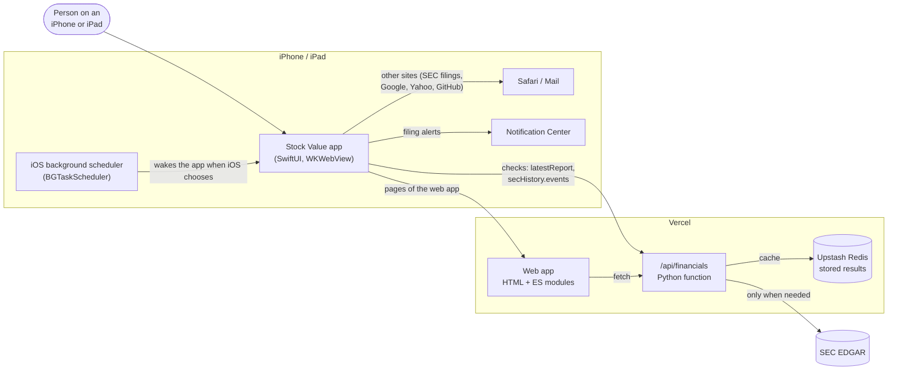
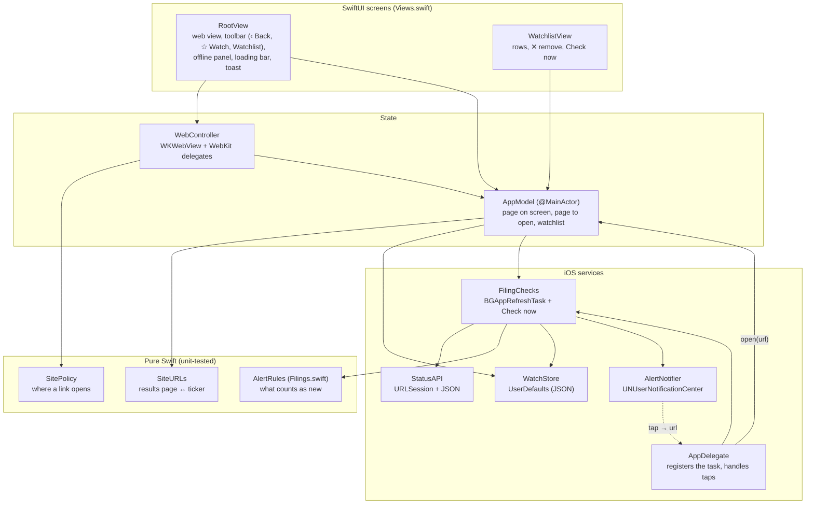
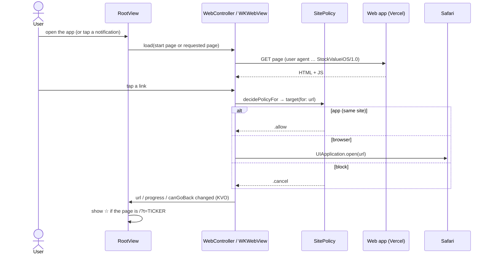
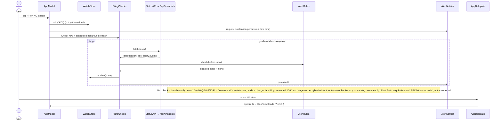
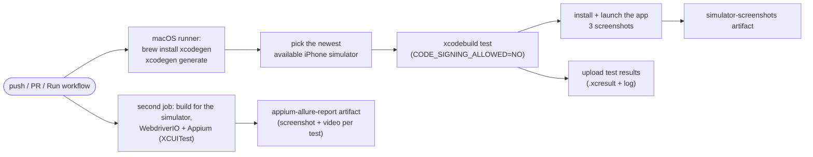

# Architecture: 10-Year Stock Value Analysis for iOS

How the iOS app is built, how its parts talk to each other and to the web app, and how it's tested and shipped. Written for engineers joining the project and for anyone reviewing it; the [README](../README.md) covers building and running. The [Android app](https://github.com/dipak-nehe/stock-value-android) follows the same design; section 9 lists where iOS differs.

**In one sentence:** a small SwiftUI app that shows the web app ([stock-value-analysis.vercel.app](https://stock-value-analysis.vercel.app)) in a WKWebView, and adds what a website can't do: a watchlist that checks SEC filings in the background and sends notifications.

---

## 1. System context



- **No backend of its own:** the app reuses the web app's pages and its cached JSON API. SEC is only contacted by the web app's function.
- **No accounts, no server-side watchlist:** the watchlist lives on the device.
- **One API contract:** `/api/financials?ticker=X&v=6`. `StatusAPI.apiVersion` must equal `API_VERSION` in the web app's `public/js/page.js` (a unit test pins it).

---

## 2. Components



| File | Responsibility |
|---|---|
| `StockValueApp.swift` | Entry point (`@main`); `AppDelegate` registers the background check, shows alerts in the foreground and opens the company on a notification tap. |
| `Views.swift` | `RootView` (web view with toolbar: Back, ☆ Watch on a company's page, Watchlist; offline panel; loading bar; short messages), `OfflineView`, `WatchlistView`. Accessibility identifiers for tests. |
| `WebController.swift` | Owns the WKWebView: settings (user agent, inspectable in debug), link routing through `SitePolicy`, new-tab links, pull to refresh, offline state, renderer recovery, Back; mirrors URL, progress and history into published properties. |
| `AppModel.swift` | Shared state: the address on screen (drives the Watch star), pages to open (from notifications or the Watchlist), the watchlist; watch/unwatch; Check now. |
| `SitePolicy.swift` | `app` for pages of the web app (same scheme, host, port), `browser` for other http/https/mailto, `block` for everything else. |
| `SiteURLs.swift` | Which pages are a company's results (`/?t=KO`); builds those addresses. |
| `Filings.swift` | `Report`, `FilingEvent`, `CompanyStatus`, `Watched`, `Alert`, and `AlertRules`. |
| `StatusAPI.swift` | `async` fetch of `/api/financials`, parsing `latestReport` and `secHistory.events`; 404 → unknown ticker. |
| `WatchStore.swift` | The watchlist (max 25) as JSON in UserDefaults; a lock serialises changes. |
| `FilingChecks.swift` | Registers and schedules the background refresh; `run` checks each company and posts alerts. |
| `AlertNotifier.swift` | Local notifications in English or Spanish; one id per filing; the tap target in `userInfo`. |
| `AppInfo.swift` | Site address (Info.plist, or `-SiteURL` in debug), user-agent tag, version, debug launch page. |

---

## 3. Key flows

### 3.1 Opening the app and following links



- **New-tab links** (`target=_blank`): `createWebViewWith` routes the address like any link instead of opening a window.
- **Back:** swipe from the edge (`allowsBackForwardNavigationGestures`) or the ‹ button when there's history.
- **Offline:** a failed page load shows `OfflineView` with *Try again* (cancelled or handed-off loads are ignored); a killed web content process triggers a reload.

### 3.2 Filing alerts



- **When checks run:** `BGAppRefreshTask` runs when iOS decides (often a few times a day for apps in use, less on low battery or if the app is rarely opened). *Check now* runs immediately; the Watchlist refreshes when a check finishes (`.watchlistChanged`).

---

## 4. Data

**On the device** (UserDefaults key `watched`, JSON from `Codable`):

```json
[{ "ticker": "KO", "name": "COCA COLA CO",
   "report": { "form": "10-Q", "date": "2026-07-29", "accession": "0001628280-26-050503", "url": "https://www.sec.gov/…" },
   "seenEvents": ["2019-03-01|late_filing|NT 10-K|https://www.sec.gov/…"],
   "baselined": true, "lastChecked": 780000000 }]
```

**Read from the API:** `ticker`, `name`, `latestReport {form, date, accession, url}`, `secHistory.events[] {date, type, form, url}`. An event's identity is `date|type|form|url`.

---

## 5. Security and privacy

| Concern | Measure |
|---|---|
| Traffic | App Transport Security: HTTPS only, except local networking (`NSAllowsLocalNetworking`) for the test server. |
| Web content | No script message handlers (no JavaScript bridge into the app); page inspection only in debug builds (`isInspectable`). |
| Links | Only the web app's own pages load in the app; others go to Safari/Mail or are blocked (unit-tested, incl. lookalike hosts). |
| Pages opened by notifications | Checked against `SitePolicy` before loading. |
| Permissions | Notifications, asked when the first company is watched; background app refresh. |
| Personal data | None collected; the watchlist stays on the device. |
| Public repository | Commits use the GitHub noreply address; no secrets in the code. |

---

## 6. Build and platform

- **Swift / SwiftUI**, iOS **17+** (iPhone and iPad), light and dark mode, English and Spanish (`en.lproj`, `es.lproj`).
- **XcodeGen:** `project.yml` defines the targets, Info.plist keys (`SiteURL`, `BGTaskSchedulerPermittedIdentifiers`, `UIBackgroundModes: fetch`, ATS) and versions; `xcodegen generate` writes the Xcode project, which isn't committed.
- **No third-party dependencies:** only Apple frameworks (SwiftUI, WebKit, BackgroundTasks, UserNotifications).
- Built on GitHub's macOS runners with the current Xcode (iOS 26 SDK at the time of writing).

---

## 7. Testing

| Layer | Where | Proves |
|---|---|---|
| **Unit** (XCTest, 22 tests) | `StockValueTests/` | The same cases as the Android unit tests: link rules, results-page detection, alert rules (baseline, once-only, oldest first, letters ignored), reading the API response, saving and capping the watchlist, the API version contract |
| **Launch check** (CI) | `.github/workflows/ios.yml` | The built app installs and opens on the simulator; screenshots of the start page, KO's results (with the ☆) and Spanish are kept as an artifact |
| **End-to-end** (WebdriverIO + Appium XCUITest) | `e2e/` | The Android repo's framework with the XCUITest driver; the web page objects are shared unchanged. Mock suite (browsing, offline, watch → Notification Center → tap, Spanish, accessibility) and live suite (analysis, compare, tab tour, wrong ticker). Screenshot and video per test in Allure |

---

## 8. CI



The repository is public, so GitHub's macOS minutes are free (private repositories count them 10×).

---

## 9. How the iOS app differs from Android

| Topic | Android | iOS |
|---|---|---|
| Web view | `WebView` + `WebViewClient` | `WKWebView` + `WKNavigationDelegate` / `WKUIDelegate` |
| Back | Back gesture/button via `OnBackPressedCallback` | Edge swipe + ‹ toolbar button |
| Background checks | WorkManager, every 12 h when online | `BGAppRefreshTask`, when iOS decides (less punctual) |
| Notifications | Notification channel; one group per alert (else a summary opens the launcher) | Local notifications; tap handled by `UNUserNotificationCenterDelegate` |
| Storage | SharedPreferences (JSON) | UserDefaults (Codable JSON) |
| Debug overrides for tests | Intent extras | Launch arguments (`-SiteURL`, `-OpenURL`) |
| Build | Gradle, locally or CI | XcodeGen + Xcode, CI only (no Xcode on the developer's Mac) |
| Tests | 21 unit, 12 Espresso, 34 Appium | 22 unit, launch screenshots, 34 Appium |

---

## 10. Limitations and next steps

- **End-to-end tests** run on every push, but a full run takes 30–60 minutes of macOS time, and Notification Center steps depend on iOS's own UI, which changes between versions.
- **Real devices, TestFlight, App Store:** need an Apple Developer account, signing, and a privacy policy; App Store review requires real native value (the watchlist and alerts).
- **Punctual alerts** would need server-side push (APNs), which means a backend with stored watchlists: a deliberate trade-off against the no-accounts design.
